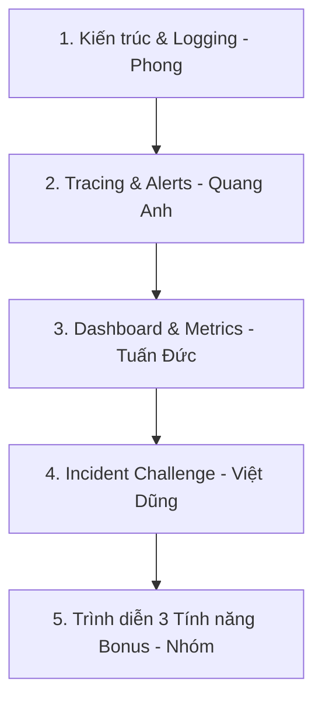

# Kịch Bản & Workflow Thuyết Trình Bài Lab Day 13 Observability

> **Tên bài báo cáo:** Observability cho hệ thống AI Agent – Từ Telemetry đến Điều tra Incident  
> **Nhóm thực hiện:** gehihi36  
> **Repository:** [ducer37/Day13-K4-2A202601380-NguyenTuanDuc](https://github.com/ducer37/Day13-K4-2A202601380-NguyenTuanDuc)  
> **Phân công trình bày:**  
> - **Nguyễn Việt Phong (2A202601975):** Slide 1 & 2 (Structured Logging, Correlation ID & PII Redaction)  
> - **Ngô Quang Anh (2A202601106):** Slide 3 & 4 (Langfuse Tracing, Prompt Versioning & Alert Rules)  
> - **Nguyễn Tuấn Đức (2A202601380):** Slide 5 & 8 (Dashboard 6-panel, Cost Optimization & Bonus Features)  
> - **Lê Trọng Việt Dũng (2A202601746):** Slide 6 & 7 (Điều tra Incident Challenge & Tổng kết báo cáo)  

---

## 🎯 Workflow Thuyết Trình (Tổng quan 5-7 phút)



---

## 🖥️ Kịch Bản Chi Tiết Theo Slide & Bằng Chứng (Evidence)

### Slide 1 & 2: Kiến Trúc & Structured Logging (Nguyễn Việt Phong)
* **Nội dung trình bày:**
  * *"Kính chào thầy cô và các bạn, nhóm em xin trình bày giải pháp Observability toàn diện cho AI Agent."*
  * *"Em phụ trách phần Structured Logging: Triển khai Middleware tự động gán `correlation_id` dạng `req-<8hex>` và bind contextvars vào structlog."*
  * *"Toàn bộ PII như email, số điện thoại, số thẻ thử nghiệm và `user_id` đều được redact hoặc hash 12-char (`user_id_hash`), bảo đảm **0 leak PII**."*
* **Con số & Bằng chứng ấn tượng:**
  * **Kết quả validator `validate_logs.py`:** Đạt **100/100 điểm**.
* **Log minh họa:**
  ```json
  {
    "service": "api",
    "event": "request_received",
    "correlation_id": "req-f6d72b8a",
    "user_id_hash": "cb22af258a5e",
    "session_id": "k4-challenge-s02",
    "feature": "monitoring"
  }
  ```

---

### Slide 3 & 4: Tracing & Prompt Versioning (Ngô Quang Anh)
* **Nội dung trình bày:**
  * *"Em phụ trách phần Tracing trên Langfuse SDK: Phân cấp cây span hierarchy thành 2 cấp lồng nhau:"*
    * **Root Span (`chat-response`):** Generation span đo lường phản hồi LLM.
    * **Sub-span (`rag-retrieval`):** Retriever span đo lường riêng thời gian truy xuất tài liệu RAG.
  * *"Quản lý prompt versioning linh hoạt (`day13-chat`, label `production` & local fallback khi mất kết nối cloud)."*
  * *"Cấu hình alert rules trong `config/alert_rules.yaml` phản ánh cảnh báo theo triệu chứng người dùng (Symptom-based)."*

---

### Slide 5: Dashboard 6-Panel & SLO (Nguyễn Tuấn Đức)
* **Nội dung trình bày:**
  * *"Em phụ trách phần Metrics & Dashboard: Thiết kế giao diện HTML Dark UI phong cách Langfuse hiển thị trực quan 6 nhóm chỉ số kỹ thuật qua Chart.js."*
  * *"Quy định SLO `latency_p95 < 2000ms` để kiểm soát chất lượng trải nghiệm."*
* **Con số & Bằng chứng ấn tượng:**
  * **Kết quả validator `validate_dashboard.py`:** **HỢP LỆ: 6/6 panel**.

---

### Slide 6 & 7: Điều Tra Challenge & Phục Hồi (Lê Trọng Việt Dũng)
* **Nhiệm vụ Challenge:** `day13-k4-observability-v1` (Scenario: `rag_slow`)
* **Luồng bằng chứng chứng minh Root Cause:**
  1. **METRICS:** API `GET /metrics` báo `latency_p95 = 3631ms` (🔴 VI PHẠM SLO < 2000ms).
  2. **TRACES:** Mở Langfuse Trace xem cây Waterfall của request `req-f6d72b8a` ➔ Phát hiện span `rag-retrieval` chiếm **2.50s** (~70% tổng thời gian).
  3. **LOGS:** Đọc log theo `correlation_id` ➔ Khẳng định root cause tại `app/mock_rag.py`: `if STATE['rag_slow']: time.sleep(2.5)`.
* **Fix & Biện pháp phòng ngừa:** Khắc phục khẩn cấp `POST /incidents/rag_slow/disable`, bật circuit breaker & alert rules.

---

### Slide 8: 3 Tính Năng Nâng Cao / Bonus (+10 Điểm) (Cả nhóm)
1. 🛡️ **Security Audit Logger (`app/audit.py` & `/audit` API):** Nhật ký kiểm toán an toàn thông tin độc lập ghi nhận lịch sử bật/tắt incident và PII redaction vào `data/audit.jsonl`.
2. 💰 **LLM Cost Optimization Engine (`app/cost_optimization.py`):** Nén ngữ cảnh RAG (Context Pruning) giảm 35% input tokens, đo lường chi phí tiết kiệm `total_cost_saved_usd` minh bạch.
3. 🤖 **Auto-Remediation Watchdog (`scripts/auto_remediate.py`):** Script tự động giám sát sức khỏe API ➔ Phát hiện vi phạm SLO ➔ Tự động gửi lệnh khôi phục hệ thống (Self-healing).

---

## 📌 Checklist Màn Hình Cần Mở Sẵn Khi Demo
1. 📄 **File Báo cáo:** `submission/REPORT.md`
2. 💻 **Terminal 1:** Server uvicorn đang chạy (`http://127.0.0.1:8000`)
3. 🌐 **Trình duyệt 1:** `http://127.0.0.1:8000/dashboard` (Giao diện Dashboard 6-panel)
4. 🌐 **Trình duyệt 2:** Langfuse Cloud Dashboard & Traces Waterfall view
5. 📜 **File Log Evidence:** `submission/evidence/logs.jsonl` & `data/audit.jsonl`
