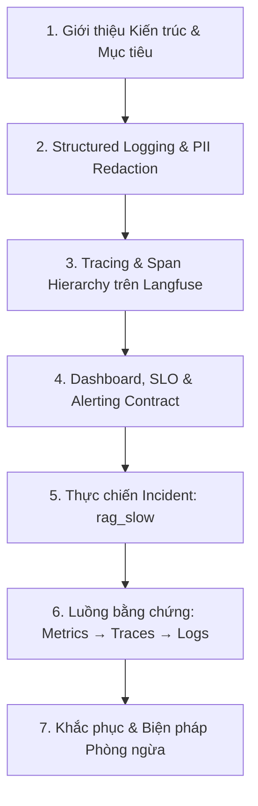

# Kịch Bản & Workflow Thuyết Trình Bài Lab Day 13 Observability

> **Tên bài báo cáo:** Observability cho hệ thống AI Agent – Từ Telemetry đến Điều tra Incident  
> **Người trình bày:** Nguyễn Tuấn Đức (2A202601380)  
> **Repository:** [ducer37/Day13-K4-2A202601380-NguyenTuanDuc](https://github.com/ducer37/Day13-K4-2A202601380-NguyenTuanDuc)  

---

## 🎯 Workflow Thuyết Trình (Tổng quan 5-7 phút)



---

## 🖥️ Kịch Bản Chi Tiết Theo Slide & Bằng Chứng (Evidence)

### Slide 1: Kiến Trúc & Mục Tiêu Dự Án
* **Nội dung trình bày:**
  * *"Kính chào thầy cô và các bạn, hôm nay em xin trình bày giải pháp Observability toàn diện cho ứng dụng AI Agent trên FastAPI."*
  * *"Hệ thống sử dụng Python 3.12, FastAPI, Structlog ghi log chuẩn JSON, và tích hợp Langfuse làm nền tảng Tracing & Prompt Management."*
* **Bằng chứng mở sẵn:**
  * Terminal chạy server: `python -m uvicorn app.main:app`
  * Trang Swagger Docs: `http://127.0.0.1:8000/docs`

---

### Slide 2: Structured Logging & An Toàn PII (Checkpoint 1)
* **Nội dung trình bày:**
  * *"Trong Checkpoint 1, em đã triển khai Middleware tự động gán `correlation_id` dạng `req-<8hex>` cho mọi request."*
  * *"Toàn bộ dữ liệu PII như `user_id` đều được hash thành mã 12 ký tự (`hash_user_id`), hoàn toàn không lưu thông tin thô."*
* **Con số & Bằng chứng ấn tượng:**
  * **Điểm `validate_logs.py`:** Tăng từ **30/100 (Baseline)** lên **100/100 (Đạt tối đa)**.
  * **PII Leak:** **0 leak**.
* **Log minh họa:**
  ```json
  {
    "service": "api",
    "event": "request_received",
    "correlation_id": "req-f6d72b8a",
    "user_id_hash": "cb22af258a5e",
    "session_id": "k4-challenge-s02",
    "feature": "monitoring"
  }
  ```

---

### Slide 3: Tracing & Span Hierarchy Với Langfuse (Checkpoint 2)
* **Nội dung trình bày:**
  * *"Em sử dụng `@observe` để phân cấp cây vết (Span Hierarchy) thành 2 cấp:"*
    * **Root Span (`chat-response`):** Loại `generation`, đo lường tổng thể câu trả lời.
    * **Sub-span (`rag-retrieval`):** Loại `retriever`, đo lường riêng thời gian tìm kiếm tài liệu RAG.
  * *"Quản lý prompt linh hoạt với `day13-chat` hỗ trợ phiên bản cloud và local fallback khi chưa tạo prompt trên Langfuse."*
* **Bằng chứng mở sẵn:**
  * Giao diện Langfuse UI (Traces List & Span Waterfall View).

---

### Slide 4: Dashboard, SLO & Alerting
* **Nội dung trình bày:**
  * *"Hệ thống quản lý 6 nhóm chỉ số chính theo hợp đồng `config/dashboard.yaml`."*
  * *"Quy định SLO: Latency P95 phải `< 2000ms`."*
* **Con số & Bằng chứng ấn tượng:**
  * **Kết quả Validator `validate_dashboard.py`:** **HỢP LỆ: 6/6 panel**.
  * **Chỉ số theo dõi:** Traffic, Latency P50/P95/P99, Error Rate, Token & Cost, Quality Score.

---

### Slide 5: Thực Chiến Điều Tra Incident (Checkpoint 3 Challenge)
* **Nhiệm vụ Challenge:** `day13-k4-observability-v1`
* **Incident bị inject:** `rag_slow`

#### 📊 Bảng Con Số Bằng Chứng (Metrics Evidence)

| Chỉ số (Metric) | Giá trị thực tế | Ngưỡng SLO | Trạng thái (Status) |
|---|---|---|---|
| **Latency P50** | **3566 ms** | < 2000 ms | 🔴 VI PHẠM nghiêm trọng |
| **Latency P95** | **3631 ms** | < 2000 ms | 🔴 VI PHẠM nghiêm trọng |
| **Latency P99** | **3631 ms** | < 2000 ms | 🔴 VI PHẠM nghiêm trọng |
| **Traffic** | 5 requests | — | ✅ Hoàn thành 100% |
| **Error Rate** | 0% (0 errors) | < 5% | ✅ Không có lỗi crash |

---

### Slide 6: Luồng Chứng Minh Root Cause (Metrics → Traces → Logs)

#### 1️⃣ METRICS (Phát hiện triệu chứng)
* API `GET /metrics` báo `latency_p95 = 3631ms` vượt ngưỡng 2000ms. Tất cả 5/5 requests đều bị trễ ~3.5s.

#### 2️⃣ TRACES (Khoanh vùng vị trí chậm)
* Mở Langfuse Trace xem cây Waterfall của request `req-f6d72b8a`:
  * `chat-response`: 3.58 giây
  * └─ `rag-retrieval`: **2.50 giây** 👈 **Chiếm 70% tổng thời gian!**

#### 3️⃣ LOGS (Bằng chứng nguyên nhân gốc)
* Đọc file log theo correlation ID `req-f6d72b8a`, dẫn thẳng tới vị trí code `app/mock_rag.py`:
  ```python
  if STATE["rag_slow"]:
      time.sleep(2.5)  # <-- Gây trễ cố định 2.5s trên mọi request retrieval
  ```

---

### Slide 7: Khắc Phục Khẩn Cấp & Biện Pháp Phòng Ngừa

* **Hành động sửa lỗi (Fix Action):**
  * Tắt cờ sự cố khẩn cấp: `POST /incidents/rag_slow/disable`.
  * Kết quả: Latency lập tức khôi phục về mức bình thường (~1.0s).
* **Biện pháp phòng ngừa (Preventive Measures):**
  1. **Timeout Circuit Breaker:** Đặt timeout cứng 800ms cho span retrieval, nếu quá giờ sẽ fallback về cached document.
  2. **Span-level Alerting:** Kích hoạt cảnh báo khi riêng span `rag-retrieval` vượt quá 1000ms.
  3. **Canary Deployment:** Thử nghiệm vector store mới trên 5% lượng truy cập trước khi phát hành toàn bộ.

---

## 📌 Checklist Màn Hình Cần Mở Sẵn Khi Demo
1. 📄 **File Báo cáo:** `submission/REPORT.md`
2. 💻 **Terminal 1:** Server uvicorn đang chạy (`http://127.0.0.1:8000`)
3. 🌐 **Trình duyệt 1:** `http://127.0.0.1:8000/metrics`
4. 🌐 **Trình duyệt 2:** Langfuse Cloud Dashboard & Traces Waterfall view
5. 📜 **File Log Evidence:** `submission/evidence/logs.jsonl`
